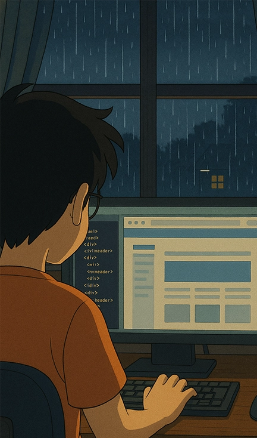

<!-- 

 -->
  

    
  

  
  
  
  
  

 

<h1 style="font-size: 1.15em; margin: 10px 0; position: relative; display: inline-block;">
  ABOUT ME
  
</h1>

Hi 👋, I am Will. an enthusiastic and ambitious web developer, passionate about creating innovative solutions and unique branding for my clients. I’m a full-stack developer and creative technologist who brings a rare cross-disciplinary skill set—combining advanced front-end development, visual design, 3D engine experience, and have an Ocd like passion for SEO. ✨.

  

 

<h1 style="font-size: 1.15em; margin: 10px 0; position: relative; display: inline-block;">
  SOME PROJECTS
  
</h1>

  
  

    
    
  

 

  

    
    
  

  

 

<h1 style="font-size: 1.15em; margin: 10px 0; position: relative; display: inline-block;">
  GITHUB STATS
  
</h1>

  

    
    
    
  

  

    
  

 

<h1 style="font-size: 1.15em; margin: 10px 0; position: relative; display: inline-block;">
  CONTACT:
  
</h1>

  

  
  
  
  
  
  
  
  
  
  
  

